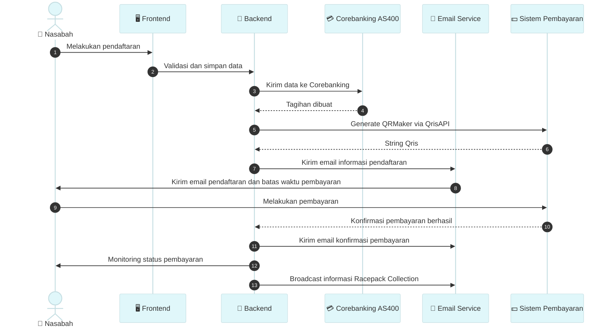

# iGateSA - iGate Synchronus Agent

## App Flow 


## Overview
**iGateSA** (iGate Synchronus Agent) is a Windows Service application developed in C# to retrieve and process data from the iGate system based on specific criteria. The service fetches data from the iGate system, processes it, and flags transactions accordingly. This application is designed to run continuously in the background, ensuring seamless integration between iGate and other systems.


Action Plan Development. Melibatkan 2 engine aplikasi


## Architecture Overview

### App_Core
This module contains essential components to connect and log activities within the application:
- **DbAS400 Class**: Handles connection to the AS400 database.
- **DbPostgress Class**: Manages the connection to the iGate Postgres database.
- **Logger Class**: Responsible for logging activities to a text file and the Windows console.

### Class Breakdown
- **BPJSTKPU Class**: Manages and processes JSON data from the BPJSTKPU iGate service. It breaks down `TransactionData`, performs processing, and flags transactions.
- **CoreDao Class**: Executes stored procedures (SP) to insert journal entries into the AS400 staging table.
- **RefParameter Class**: Used to retrieve global parameters from AS400 (currently not utilized in this version).
- **TrxDataLog Class**: Retrieves data from iGate, applies filters, and splits the journal entries.

### Root Directory
- **App.config**: Configuration file for the application. This includes settings for databases, logging, notifications, and other application parameters.
- **AppMain.cs**: The core class of the application. For further module expansions (e.g., split journal for TASPEN, DD, etc.), this class can be extended by adding new classes and logic.
- **Program.cs**: The entry point of the application. This class is responsible for initializing the service as either a Windows console application or a Windows service. No further modifications are typically required here.

## Application Flow

The application's flow and logic are well-documented within the code for ease of understanding. The key flow is outlined as follows:

1. **Program.cs**: Entry point for the application.
2. **AppMain.cs**: Core application logic starts here.
3. **TrxDataLog.cs** and **BPJSTKPU.cs**: Responsible for retrieving and processing iGate data.
4. **BPJSTKPU.cs** => **CoreDao.cs**: Calls the stored procedure to insert the processed journal data into AS400.
5. **Completion**: Application completes the transaction cycle.

## How to Install and Run

### Prerequisites
- .NET Framework (version used in the project)
- Access to AS400 and iGate databases

### Steps to Install
1. Clone the repository: 
   ```bash
   git clone https://github.com/your-repo/igate-sa.git
